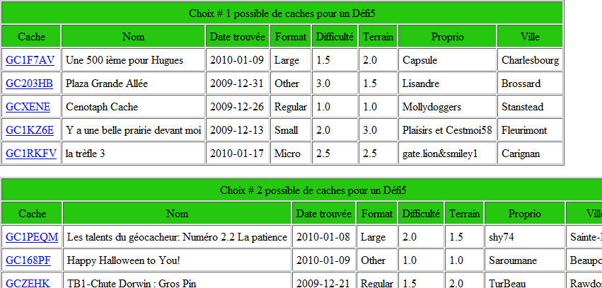

Voici une macro GSAK pour vous aider à évaluer les caches 
					disponibles afin de remplir les exigences des caches de type 
					Défi 5 dont vous trouverez les spécifications sur cet 
					exemple type de publication de géocache:
					<a target="_blank" href="http://www.geocaching.com/seek/cache_details.aspx?guid=44754c7b-2a78-4ff1-995b-d0206d002d1b">
					Le DÉFI 5 (Lanaudière</a>).  
					 
					Vous trouverez ici l<a target="_blank" href="http://www.geocaching.com/bookmarks/view.aspx?guid=8cccd3c1-9b62-4e43-9e81-b6581714d7f0">a 
					liste complète (Bookmark</a> list) des caches de type Défi5 qui couvre les régions du Québec. Cette liste est 
					maintenue par le concepteur original du challenge,
					<a href="http://www.geocaching.com/profile/default.aspx?guid=baf42847-7443-43c5-b1cf-22621ff957c9">
					Flag43</a>. 
					 
					Voici un
					<a href="https://github.com/OpusTerra/Geocaching_Defi5/blob/main/Sample_ResultDefi5Caches.html">
					exemple du résultat</a> produit par cette macro. 
					 
					
     					 
					 
					 
					Au démarrage, la macro vous affichera cette boite de dialogue: 
					 
					<table style="width: 100%">
									<tr>
													<td class="style3">
													
													</td>
													<td valign="top" class="style2">
													Le check box <em><strong>
													Filtrer par date trouvée 
													depuis</strong></em> ainsi 
													que le champ <em><strong>
													Date</strong></em> 
													qui suit sert à spécifier à 
													la macro la date à partir de 
													laquelle les géocaches 
													admissibles seront prises en 
													ligne de compte. On doit 
													avoir la possibilité de 
													changer cette date en 
													fonction de la date de 
													parution de la cache Défi5 
													car les caches trouvées 
													auparavant ne sont pas 
													admissibles. Assurez-vous 
													d'être avec la base de 
													donnée qui contient tous vos 
													Found avant de lancer cette 
													macro. 
													 
													La liste des <strong><em>
													Champs contenant le nom de 
													la ville</em></strong> sert 
													à spécifier quel champ User 
													vous aurez inscrit le nom de 
													la ville à laquelle 
													appartient la géocache. 
													Notez que cette opération 
													doit se faire de facon 
													manuelle car il n'y a pas 
													moyen actuellement de 
													localiser automatiquement 
													une géocache dans le 
													périmètre administratif 
													d'une ville en particulier. 
													Pour automatiser cette 
													inscription, Il faudrait se 
													procurer (100$) un certain 
													fichier vectoriel du 
													découpage administratif 
													québécois qui est vendu par 
													la Géoboutique du Québec. 
													 
													Le bouton suivant intitulé
													<strong><em>Editer codes 
													déjà utilisés</em></strong> sert 
													à poiuvoir spécifier les 
													caches qui ne doivent plus 
													être évaluées car elles ont 
													déjà été utilisées afin de 
													remplir les exigences d'un 
													Défi5. Plus de détail 
													ci-dessous ...</td>
									</tr>
					</table>
					 

					<table style="width: 101%">
									<tr>
													<td><strong>Exemple de 
													contenu du
													Fichier 
													des codes déjà utilisés</strong></td>
									</tr>
									<tr>
													<td class="style6"> 
													# Note: 
													mettre un # au début d'une 
													ligne pour la considérer 
													comme  
													# commentaire seulement. 
													# 
													# Format: 
													# Nom du défi;Code du 
													défi;Liste des 5 codes 
													choisis pour ce défi  
													# chaque code étant séparé 
													par un ; 
													# 
													# Exemple d'une liste de 
													caches défi5 déjà réalisés 
													Defi5Estrie;GC21BQD;GC1XPQ0;GC1XC5N;GC1Y4H9;GC1E929;GC1Q048; 
													Defi5Chaudieres;GC21PN1;GC212CR;GC1NAZZ;GC1NKEH;GC1P3PW;GC21979; 
													</td>
									</tr>
									<tr>
													<td class="style4"> 
													Vous 
													allez donc devoir mettre à 
													jour ce fichier au fur et à 
													mesure que vous allez 
													réussir à trouver les 
													différentes caches Défi5 
													qui existent. 
													</td>
									</tr>
					</table>
					 
					<strong>L'utilisation de la macro  
					</strong> 
					Ça se fait habituellement de façon itérative.  
					 
					Quand vous lancez l'exécution vous aurez un écran DOS 
					typique dans lequel vous verrez à l'œuvre la macro. 
					 
					 
					 
					 
					Après un certain temps, vous obtiendrez un rapport HTML qui 
					vous affichera des blocs possibles de caches. 
					 
					Dans le bas de la page, vous aurez un résumé de ce genre: 
					 
					<table class="style11">
									<tr>
													<td style="width: 580px">
					
19 noms de villes sont encore manquantes pour obtenir un 
					résultat complet. 

					

					<table id="table2" style="font-family: Arial,sans-serif; 
font-size: 10px;" width="425" class="style10">
									<tr>
													<td colspan="4" align="center">
													Mini stats sur les défis</td>
									</tr>
									<tr>
													<td bgcolor="#25c70f" width="86">
													&nbsp;</td>
													<td bgcolor="#81f781" width="86">
													&nbsp;</td>
													<td bgcolor="#c232d8" width="86">
													&nbsp;</td>
													<td bgcolor="#ccccff" width="86">
													&nbsp;</td>
									</tr>
									<tr>
													<td align="center" width="86">
													Infos complètes</td>
													<td align="center" width="86">
													Ville(s) à compléter</td>
													<td align="center" width="86">
													Manque un Found</td>
													<td align="center" width="86">
													Manque + Found</td>
									</tr>
									<tr>
													<td align="center" width="86">
													0</td>
													<td align="center" width="86">
													5</td>
													<td align="center" width="86">
													0</td>
													<td align="center" width="86">
													0</td>
									</tr>
					</table>
					

													</td>
									</tr>
					</table>
					 
					Par un système de couleur, on vous indique la pertinence des 
					résultats. Dans ce cas ci, il y a 0 bloc de caches que vous 
					pourriez vous servir pour obtenir l'autorisation de logger 
					Found un certain Défi5. Il y a cependant 5 blocs de caches 
					dont il faudrait&nbsp;seulement compléter les noms de villes pour 
					chacune des caches. Notez que le GSAK vous affiche alors la 
					liste des caches retenues par la macro. Vous pouvez donc 
					aller inscrire le noms des villes pour chacune des caches du 
					rapport et <strong>recommencer</strong> l'exécution de la macro jusqu'à ce 
					que vous obteniez un ou plusieurs bloc de caches contenues 
					dans un tableau de couleur vert foncé. 
					 
					Pour soumettre une série de 5 caches à Flag43, vous pouvez 
					faire un copier/coller d'un tableau valide et lui envoyer 
					par courriel HTML. 
					 
					Suite à l'approbation et à la découverte d'une cache Défi5, 
					vous devrez aller inscrire les Codes GC de caches utilisées 
					dans le fichier dont on a discuté ci-haut.  
					 
					Bon défi5! 
					 
					Vous pouvez obtenir la plus récente version de la macro en 
					cliquant ici:  
					 
					<a linkindex="126" onclick="window.open(this.href);return false;" class="postlink" href="Misc/Defi5_V3.gsk?id=9">Defi5_V3.gsk 
					</a>(téléchargé 
					fois) (Version actuelle: 1.92) 
					 
					Notes: 
					 
					- Juin 2010: Version 1.91: Ajout d'une vérification de 
					touche pressée sur le clavier afin d'arrêter prématurément 
					le fonctionnement de la macro. Vous aurez alors quand même 
					une liste de défis tels que le système aura trouvé à ce 
					point de son évaluation. Utile quand on commence à avoir pas 
					mal de possibilités!  
					 
					- Juillet 2010: Assurez-vous de laisser quelques lignes 
					vierges à la fin du fichier des codes déjà utilisés. 
